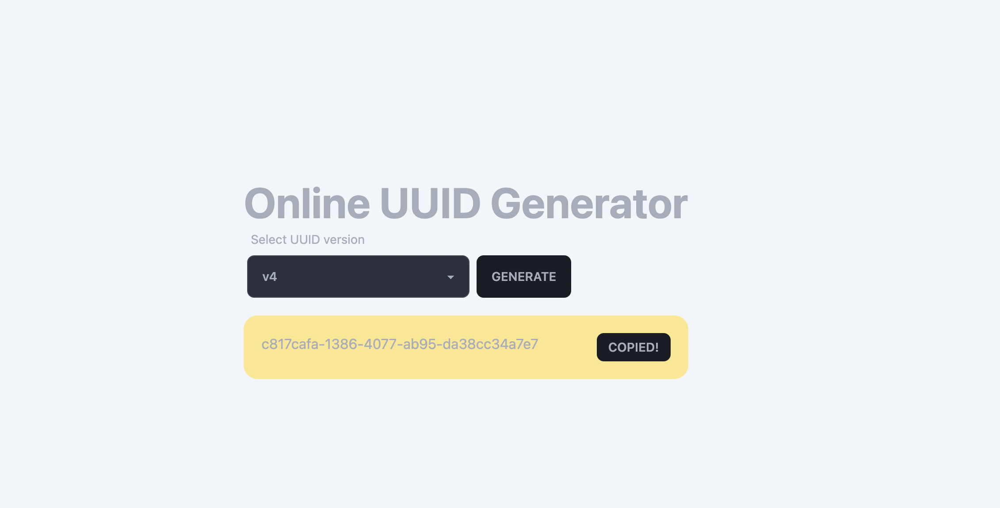

# Online UUID Generator

This is a simple UUID generator that runs in your browser. It uses the [Web Crypto API](https://developer.mozilla.org/en-US/docs/Web/API/Web_Crypto_API) to generate cryptographically secure random numbers.

## How to run

```
docker-compose up
```

## Techstack

* [Docker](https://www.docker.com/)
* [Vue.js](https://vuejs.org/)
* [Vite](https://vitejs.dev/)
* [Tailwind CSS](https://tailwindcss.com/)
* [DaisyUI](https://daisyui.com/)


